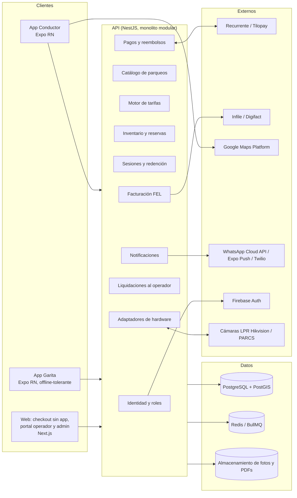
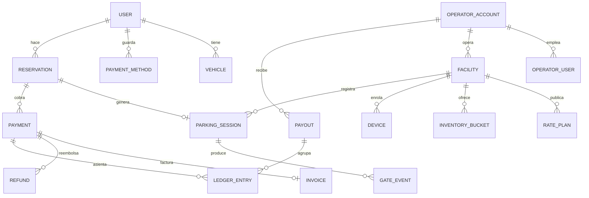

# Arquitectura técnica — App de parqueos para Guatemala

> Versión 0.1 · octubre 2026. Complementa `01-plan-de-desarrollo.md`. Las decisiones están tomadas para un equipo de 2 desarrolladores que debe entregar un MVP en 12 semanas y operar con poco presupuesto; cada una indica la alternativa descartada y cuándo reconsiderarla.

## 1. Decisiones de stack

| Capa | Decisión | Por qué | Alternativa descartada / cuándo reconsiderar |
|---|---|---|---|
| Lenguaje | **TypeScript en todo** (móvil, web, backend) | Un solo lenguaje para 2 devs; tipos compartidos entre API y apps; talento disponible en Guatemala | Flutter + Go/Python: excelente, pero duplica lenguajes |
| Móvil (conductor y garita) | **React Native con Expo** (SDK estable, EAS Build/Submit, Expo Router) | Android + iOS desde una base; OTA updates para corregir rápido fallas en garita; cámara/QR, mapas y push maduros | Flutter si el equipo ya lo domina; nativo puro no se justifica |
| Web (checkout público + portal operador + admin) | **Next.js** (App Router) + Tailwind + shadcn/ui | Mismo lenguaje; el checkout web sin app (desde el QR del rótulo o un link de WhatsApp) es parte del MVP; tablas y reportes rápidos | Panel dentro de la app móvil: insuficiente para reportes y no cubre al usuario sin app |
| Backend | **NestJS** como **monolito modular** (módulos por dominio: identidad, catálogo, tarifas, inventario, reservas, sesiones, pagos, facturación, liquidaciones, notificaciones, hardware) | SpotHero mismo escaló años con un monolito y luego lo modularizó; microservicios serían prematuros | Supabase/Firebase como backend completo: rápido para CRUD, pero la lógica de inventario, cobros y webhooks necesita un backend propio |
| Base de datos | **PostgreSQL 16 + PostGIS**, ORM **Prisma** (o Drizzle) | Búsqueda geoespacial nativa, transacciones serias para inventario, JSONB para tarifas | MongoDB: sin ventaja aquí |
| Caché / colas / locks | **Redis** (Upstash o gestionado) + **BullMQ** | Jobs de cobro de excedentes, recordatorios, reintentos de webhooks, liquidaciones | Cron en el monolito solo al inicio |
| Autenticación | **Firebase Authentication** (teléfono OTP, Google, Apple) con verificación del ID token en la API; OTP por WhatsApp propio en Fase 2 | Resuelve Apple/Google Sign-in y OTP sin construir; barato al inicio | Supabase Auth o Auth.js: válidas; Firebase tiene mejor soporte RN para phone auth |
| Pagos | **Recurrente** (Guatemala) como pasarela primaria detrás de una **interfaz `PaymentProvider`**; **Tilopay** o VisaNet/Cybersource como secundaria | API REST con tokenización, webhooks firmados y suscripciones; liquidación 24 h; requiere S.A. guatemalteca con FEL **(verificar)** | Stripe no acepta empresas guatemaltecas (solo vía LLC en EE. UU.); Kushki no opera en GT **(verificar)** |
| Facturación | **FEL** vía certificador con API (**Infile** o **Digifact**) detrás de `InvoiceProvider`, con **emisión multi-emisor**: la factura del servicio de parqueo sale a nombre del operador (su NIT y sus credenciales FEL registradas en el certificador) y la plataforma emite su propia FEL por fee, comisión y SaaS | Obligatoria; evita que la plataforma asuma IVA e ISR sobre el 100 % del flujo; el recibo con FEL es parte del valor **(confirmar con contador)** | Facturar todo desde la plataforma: más simple, pero carga fiscal y exposición ante DIACO sobre todo el GMV |
| Mapas | **Google Maps Platform** (Maps SDK vía `react-native-maps`, Places Autocomplete, Geocoding) | Mejor cobertura de POIs en Guatemala; tope gratuito por SKU desde 2025 **(verificar)** | Mapbox + OpenStreetMap si el costo escala (OSM Guatemala mejoró en 2024) |
| Mensajería | **WhatsApp Cloud API (Meta)**, **Expo Push** (FCM/APNs), **SMS Twilio** solo como respaldo | WhatsApp ≈ US$0.011/mensaje vs SMS ≈ US$0.127 **(verificar)** | Twilio para WhatsApp si Meta directo complica la verificación |
| Hosting | **PaaS** (Railway, Render o Fly.io) para API y workers; **Neon o Supabase** para Postgres gestionado; **Vercel** para Next.js | Cero DevOps al inicio; migración a AWS (ECS Fargate + RDS, región us-east-1 o México Central) cuando haya tracción | AWS desde el día uno: más tiempo de setup |
| Observabilidad | **Sentry** (errores móvil + API), **PostHog** (producto), logs en Better Stack o Grafana Cloud | Suficiente y barato | Datadog cuando haya presupuesto |
| CI/CD | **GitHub Actions** + **EAS Build/Submit** + despliegues por rama (`main` → producción, `develop` → staging) | Estándar | — |
| Monorepo | **pnpm workspaces + Turborepo** | Compartir tipos, validaciones (zod) y clientes de API | Repos separados: fricción innecesaria para 2 devs |

## 2. Vista general



## 3. Componentes

### 3.1 App Conductor (`apps/mobile`)
- Pantallas MVP: inicio/mapa con búsqueda por destino (Places Autocomplete) y "cerca de mí"; lista/mapa de resultados con precio para el rango elegido; ficha del parqueo (fotos, cómo entrar, reglas, horario); selector de horario y vehículo; pago (tarjeta guardada vía SDK/hosted fields de la pasarela); **pase digital** con QR dinámico, código de 6 dígitos, placa y botón de "Cómo llegar"; mis reservas; extender; recibos y facturas; vehículos; métodos de pago; soporte (WhatsApp y teléfono).
- El QR se regenera cada 60 s (firma con validez corta) para evitar capturas reenviadas; el código de 6 dígitos es estable durante la reserva.
- Deep links `app://reserva/{id}` desde WhatsApp y push.

### 3.2 App Garita (`apps/garita`)
- Para el guardia: botones grandes, alto contraste, funciona con una mano. Pantallas: escanear QR; buscar por placa o código; lista de "llegan hoy"; iniciar sesión drive-up (placa + tipo de vehículo + foto opcional); cerrar sesión y cobrar (muestra monto; opciones: tarjeta en app del conductor, QR bancario, efectivo registrado); cierre de turno.
- **Offline-tolerante:** cada 2 minutos descarga las reservas del día de su parqueo (lista pequeña) y la clave pública para verificar firmas; valida QR y códigos sin red; encola los eventos (`ScanEvent`) en SQLite y sincroniza al recuperar señal. Conflictos se resuelven en el servidor con reglas simples (primer check-in gana).
- Un dispositivo se enrola con un código de 8 caracteres generado por el portal; queda ligado a un `Facility` y a un `OperatorUser` con rol `guard`.

### 3.3 Web: checkout público, Portal Operador y Admin (`apps/web`)
- **Checkout público (sin app):** el QR del rótulo del parqueo o el link que envía el guardia por WhatsApp abre `/{facility}/pagar`, donde el conductor ingresa placa y paga con tarjeta o QR bancario, recibe el pase y la factura por WhatsApp. También permite reservar desde el navegador. Es la respuesta a "ninguna app latinoamericana escaló sin un camino sin app".
- Operador: alta del parqueo (ubicación, fotos, horarios, instrucciones de acceso, capacidad total y **cupos reservables**), tarifas (ver 4.3) incluido el **modo evento** (fecha, tarifa y cupos especiales), guardias y dispositivos, ventas del día, cierre de caja, liquidaciones y facturas, exportación CSV.
- Admin interno: aprobación de parqueos, soporte (buscar reserva por placa/teléfono, reembolsar, reasignar), parámetros de comisión, monitoreo de fallos en garita, métricas.

### 3.4 API (`apps/api`)
- REST con OpenAPI generado (cliente tipado en `packages/api-client`); versión `/v1`.
- Módulos de dominio con límites claros; comunicación interna por eventos de dominio (EventEmitter) que luego pueden salir a colas.
- Webhooks entrantes: pasarela (pagos, reembolsos), certificador FEL, Meta (estado de mensajes). Verificación de firma obligatoria e idempotencia por `event_id`.
- Workers (BullMQ): recordatorios, cobro de excedentes, reintentos de FEL, generación de liquidaciones semanales, limpieza de reservas no pagadas.

## 4. Modelo de datos (entidades principales)



| Entidad | Campos clave | Notas |
|---|---|---|
| `User` | id, teléfono, email, nombre, NIT opcional, idioma, estado | Identidad en Firebase; aquí perfil y preferencias |
| `Vehicle` | user_id, placa (normalizada), tipo (auto/moto/pickup), color, por defecto | Placa es dato personal: cifrar en reposo o tokenizar para búsqueda |
| `PaymentMethod` | user_id, provider, token, últimos 4, marca, vencimiento | Nunca guardamos PAN; solo tokens de la pasarela |
| `OperatorAccount` | razón social, NIT, régimen fiscal, cuenta bancaria (cifrada), plan (free/pro/enterprise), comisión % | Un operador puede tener varios parqueos |
| `OperatorUser` | operator_id, user_id, rol (owner/admin/guard) | Guardias usan la app garita |
| `Facility` | operator_id, nombre, geom (PostGIS Point), dirección, zona, fotos, horarios (JSONB), instrucciones de acceso, capacidad_total, cupos_reservables, amenities, hardware_level (0–3), estado (borrador/activo/pausado) | Índice GiST para búsqueda por radio |
| `RatePlan` / `RateRule` | facility_id, tipo (por hora, plana, por día, nocturna, evento, mensual), vehículo, ventana horaria, precio, mínimo, máximo diario, periodo de gracia, redondeo | Motor de tarifas puro y testeado unitariamente |
| `InventoryBucket` | facility_id, inicio de slot (15 min), capacidad_reservable, reservados | Se materializa por demanda para el horizonte de 30 días |
| `Reservation` | user_id, facility_id, vehicle_id, inicio, fin, precio_cotizado, desglose (JSONB: tarifa del parqueo, fee de reserva, IVA), estado, código_6, qr_secret | Ver máquina de estados |
| `ParkingSession` | reservation_id opcional, facility_id, placa, entrada, salida, origen (reserva/drive-up/LPR), monto_final, estado | Una sesión puede existir sin reserva |
| `GateEvent` | session_id, device_id, tipo (check-in, check-out, denegado, sin-espacio), método (QR/código/placa/LPR), offline (bool), timestamp del dispositivo y del servidor | Fuente de la métrica "fallo en garita" |
| `Payment` | reservation_id, session_id o `charge_group_id`, provider, provider_ref, monto, moneda GTQ, estado, método (tarjeta/QR bancario/efectivo), captura | Idempotencia por clave de cliente |
| `ChargeGroup` | user_id, sesiones agrupadas, total acumulado, fecha de corte | Agrupa sesiones pequeñas (< Q20) para cobrarlas en un solo cargo al llegar a Q50 o a los 7 días; si el cargo falla, la cuenta queda bloqueada hasta regularizar |
| `Event` | facility_id, nombre, inicio, fin, tarifa de evento, cupos reservables extra | Modo evento básico del MVP; en Fase 2 crece a venta anticipada con organizadores |
| `Refund` | payment_id, monto, motivo (cancelación/sin espacio/soporte), estado | |
| `Invoice` | payment_id, **emisor** (operador o plataforma), certificador, UUID FEL, serie, número, receptor (NIT o CF), XML y PDF en S3, estado, reintentos | Emisión asíncrona con reintentos; dos facturas por pago cuando aplica: la del operador por el parqueo y la de la plataforma por el fee |
| `LedgerEntry` | cuenta (operador, plataforma, pasarela, impuestos), débito/crédito, referencia | Contabilidad de partida doble simplificada para liquidaciones auditables |
| `Payout` | operator_id, periodo, bruto, comisión, fees de pasarela, neto, estado, comprobante | Semanal |
| `Device` | facility_id, nombre, plataforma, último sync, clave de enrolamiento | |
| Fase 2: `Pass`, `PassSubscription`, `PrepaidCredit` (crédito de uso exclusivo, no retirable), `EventInventory`, `MerchantValidation`, `Promo`, `Referral`, `BusinessAccount` | | |

### 4.1 Máquina de estados de la reserva
`QUOTED` → `PENDING_PAYMENT` → `CONFIRMED` → `CHECKED_IN` → `COMPLETED`
Ramas: `PENDING_PAYMENT` → `EXPIRED` (10 min sin pago); `CONFIRMED` → `CANCELLED` (gratis hasta la hora de inicio) ; `CONFIRMED` → `NO_SHOW` (fin + 30 min sin check-in; se cobra); `CONFIRMED`/`CHECKED_IN` → `REFUNDED_NO_SPACE` (guardia marca "sin espacio"; reembolso automático y registro contra el operador); `CHECKED_IN` con salida posterior a `fin` → `COMPLETED` con cargo de excedente según `RateRule`.

### 4.2 Inventario y concurrencia
- El operador define `cupos_reservables` (por ejemplo, 20 % de la capacidad) para no sobrevender el drive-up.
- Reservar = transacción que bloquea los `InventoryBucket` del rango (`SELECT … FOR UPDATE`) y verifica `reservados < capacidad_reservable` en todos; si pasa, incrementa y crea la reserva en `PENDING_PAYMENT`. Un job libera cupos de reservas expiradas.
- La disponibilidad "en tiempo real" del MVP es: cupos reservables libres + señal del guardia ("lleno" / "disponible") desde la app garita. El conteo por LPR o barrera llega en las capas de hardware 2–3.

### 4.3 Motor de tarifas
Función pura `cotizar(ratePlan, vehículo, inicio, fin, eventos, feePolicy) → {total, desglose}` con reglas: periodo de gracia, redondeo (por ejemplo, a 30 min), tarifa plana por ventana (Q15 hasta 4 h), máximo diario, tarifa nocturna, tarifa de evento que sobreescribe, **fee de reserva** (Q2–Q5 según segmento, siempre visible como línea separada) y descuentos/validaciones de comercio (Fase 2). Cobertura de tests ≥ 95 % porque aquí viven las disputas con usuarios y operadores.

## 5. Flujos clave

### 5.1 Reserva y pago
1. App pide cotización (`POST /quotes`) → tarifa del parqueo + fee de reserva + IVA, desglosados.
2. `POST /reservations` crea reserva `PENDING_PAYMENT` y un intento de pago con la pasarela usando el token de la tarjeta; monto se **autoriza y captura** al confirmar (política de cancelación gratis hasta la hora de inicio → reembolso total si cancela antes). Alternativa sin tarjeta: QR bancario / transferencia con confirmación por webhook y expiración a 10 minutos.
3. Webhook de pago confirmado → `CONFIRMED`; se genera `qr_secret` y `código_6`; se emite FEL en segundo plano; se envía WhatsApp con el pase y deep link.
4. Recordatorio 30 min antes; aviso 15 min antes de vencer con botón "Extender".

### 5.2 Redención (check-in / check-out)
- QR = JWT compacto `{res, fac, plate, nbf, exp}` firmado con la clave privada de la plataforma; rota cada 60 s. La garita verifica firma y ventana offline; en línea además consulta estado.
- Check-out: el guardia escanea de nuevo o busca por placa; el servidor cierra la sesión y calcula el excedente. Montos pequeños (< Q20) de usuarios con tarjeta tokenizada se suman a su `ChargeGroup` y se cobran en un solo cargo al llegar a Q50 o a los 7 días, para no pagar Q1.20 fijo por cada sesión; montos mayores se cobran de inmediato. Si falla el cobro, la app del conductor pide otro método y el guardia puede aceptar QR bancario o efectivo registrado.

### 5.3 Drive-up (sin reserva)
- El guardia crea sesión con placa, o el conductor escanea el **QR fijo** del rótulo del parqueo: si tiene la app, abre `app://driveup/{facility}`; si no, abre el **checkout web** `/{facility}/pagar` y paga desde el navegador con tarjeta o QR bancario. Al salir, se cobra con la tarifa publicada. Si el conductor no quiere pagar digital, el guardia registra pago en efectivo y el sistema emite FEL igual.

### 5.4 Liquidación al operador
- Cada pago crea asientos: bruto al operador, fee de reserva y comisión a la plataforma, fee de pasarela (lo absorbe el operador en drive-up y la plataforma en reservas, configurable por contrato), IVA de cada emisor. Job semanal agrupa asientos en `Payout`, genera estado de cuenta PDF y marca la transferencia (manual al inicio; API bancaria/ACH cuando exista).
- Facturación: por cada pago, la FEL del servicio de parqueo se emite a nombre del operador con sus credenciales en el certificador; la plataforma emite su FEL por el fee/comisión al conductor o por el SaaS al operador. Operadores sin NIT activo no pueden cobrar digital hasta regularizarse (los acompañamos en el alta como pequeño contribuyente).

## 6. Integración con hardware por niveles

| Nivel | Qué hay en el parqueo | Qué hacemos nosotros | Fase |
|---|---|---|---|
| **L0 Garita** | Nada o barrera manual | App Garita en el teléfono del guardia (QR, código, placa) | MVP |
| **L1 QR fijo** | Rótulo con QR en la entrada | Drive-up autoservicio; el guardia solo confirma | MVP / Fase 2 |
| **L2 LPR propio** | Cámara ANPR Hikvision (~Q7–8 mil **(verificar)**) + relé a la barrera | Agente de borde (`apps/edge-agent`, Node en mini PC o Raspberry Pi) recibe eventos ANPR por ISAPI/HTTP push, consulta la API, abre barrera por relé/GPIO; cola local si no hay internet | Piloto Fase 2, escala Fase 3 |
| **L3 PARCS existente** | CAME/Parkare, ZKTeco ZKParking u otro vía DIPSA, ISS, Systeco, Inalarm | Integración por API del fabricante cuando exista, o interoperabilidad por **QR impreso en formato del PARCS** / lista blanca de placas sincronizada; se negocia caso por caso con el integrador | Fase 3 (grupo ancla) |

Regla de diseño: el dominio `Sesiones` no sabe de hardware; recibe `GateEvent` de cualquier adaptador (`HardwareAdapter`: garita, edge-agent, PARCS).

## 7. Seguridad, privacidad y cumplimiento
- **PCI:** nunca tocamos el PAN; captura con SDK o campos alojados de la pasarela; SAQ-A.
- **Datos personales:** placas, ubicación y teléfono son sensibles. Minimización, cifrado en reposo (columnas con `pgcrypto` o KMS), retención definida (eventos de garita 24 meses, fotos de ingreso 30 días), consentimiento explícito y política de privacidad aunque la ley (iniciativa 6464) aún no esté vigente **(verificar)**.
- **Acceso:** RBAC (conductor, guard, operator_admin, owner, platform_admin), tokens de corta vida, revocación de dispositivos de garita, rate limiting, auditoría (`AuditLog`) de acciones administrativas y reembolsos.
- **Integridad financiera:** idempotencia en pagos y webhooks, conciliación diaria contra la pasarela, libro mayor de partida doble.
- **Disponibilidad:** la garita funciona offline; la API con health checks y despliegue sin downtime; backups PITR de Postgres; RPO 5 min, RTO 1 h al inicio.

## 8. Entornos, pruebas y despliegue
- Entornos: `local` (docker-compose: Postgres+PostGIS, Redis, mocks de pasarela y FEL), `staging` (sandbox de Recurrente y certificador), `producción`.
- Pruebas: unitarias (motor de tarifas, inventario, máquina de estados), integración (webhooks con firmas reales del sandbox), E2E móvil con Maestro para reservar → escanear → salir, y un **protocolo de prueba de campo** (checklist en garita con señal y sin señal) antes de cada release que toque redención.
- Releases móviles: canal interno (TestFlight / Internal testing) para guardias y beta; OTA con EAS Update para correcciones de JS; versiones nativas mensuales.

## 9. Estructura del monorepo

```
.
├── apps/
│   ├── api/              # NestJS (monolito modular) + workers BullMQ
│   ├── mobile/           # Expo RN — App Conductor
│   ├── garita/           # Expo RN — App Garita (offline-tolerante)
│   ├── web/              # Next.js — checkout público sin app, portal operador y admin interno
│   └── edge-agent/       # Node — agente LPR/barrera (Fase 2)
├── packages/
│   ├── shared/           # tipos de dominio, esquemas zod, constantes, utilidades de placas
│   ├── api-client/       # cliente tipado generado desde OpenAPI
│   ├── pricing/          # motor de tarifas (puro, sin dependencias)
│   ├── payments/         # interfaz PaymentProvider + adaptadores Recurrente/Tilopay
│   ├── invoicing/        # interfaz InvoiceProvider + adaptadores Infile/Digifact
│   └── ui/               # componentes RN compartidos (conductor/garita)
├── infra/                # docker-compose, scripts, IaC cuando migremos a AWS
├── docs/                 # este plan, ADRs (decisiones de arquitectura), runbooks
├── research_notes/ y reports/  # investigación de mercado
├── turbo.json · pnpm-workspace.yaml · package.json · .github/workflows/
```

## 10. Plan de sprints del MVP (12 semanas, 6 sprints)

| Sprint | Backend | Apps | Resultado verificable |
|---|---|---|---|
| **S1** (sem 7–8) | Monorepo, CI, Postgres+PostGIS, auth (Firebase), modelo de datos, CRUD de parqueos y tarifas, búsqueda por radio, OpenAPI | Esqueleto de las 3 apps, diseño en Figma aprobado, mapa con parqueos de prueba | Buscar parqueos en el mapa desde la app con datos reales de 3 parqueos piloto |
| **S2** (sem 9–10) | Motor de tarifas con fee de reserva y modo evento (tests), cotizaciones, inventario y reservas (`PENDING_PAYMENT`→`CONFIRMED` con pago simulado), QR firmado y código de 6 | Conductor: ficha, selector de horario, pago mock, pase con QR. Operador: alta de parqueo, tarifas, cupos, eventos | Reservar y ver pase; operador ve la reserva |
| **S3** (sem 11–12) | Pasarela real en sandbox (tokenización, cobro, reembolso, webhooks idempotentes), cancelaciones, no-show, expiraciones | Conductor: tarjetas guardadas, cancelación, mis reservas. Garita: enrolamiento, escaneo QR, lista del día, validación offline | Pago real en sandbox y check-in sin señal |
| **S4** (sem 13–14) | Sesiones drive-up, check-out con excedente, cobro agrupado (`ChargeGroup`), pagos en garita (QR bancario/efectivo), WhatsApp + push, recordatorios | Garita: drive-up, cobro de salida, cierre de turno. Conductor: extender, notificaciones. **Web: checkout público sin app** | Flujo completo entrar → salir → cobrar en un parqueo piloto, con y sin app |
| **S5** (sem 15–16) | FEL multi-emisor (operador y plataforma; emisión asíncrona, reintentos, PDF), libro mayor, liquidaciones semanales, reportes, admin de soporte y reembolsos | Operador: ventas, cierre de caja, liquidaciones, facturas, alta de credenciales FEL. Admin: soporte | Factura FEL válida por cada pago; estado de cuenta semanal |
| **S6** (sem 17–18) | Hardening: rate limiting, auditoría, conciliación, monitoreo, backups, runbooks | Pruebas de campo en 3 parqueos (con y sin señal), accesibilidad, textos, TestFlight/Internal testing, políticas y soporte | Demo end-to-end con dinero real y métricas en PostHog; listo para beta cerrada |

## 11. Decisiones de arquitectura a registrar (ADRs iniciales)
1. Monolito modular NestJS en lugar de microservicios.
2. React Native/Expo para ambas apps móviles.
3. Recurrente como pasarela primaria detrás de una interfaz; segunda pasarela antes del lanzamiento público.
4. No custodiar saldo de usuarios en el MVP.
5. QR firmado con rotación de 60 s + código de 6 dígitos como respaldo offline.
6. Cupos reservables definidos por el operador como modelo de inventario del MVP.
7. PaaS primero; AWS cuando haya > 50 parqueos o requisitos de un grupo ancla.
8. FEL multi-emisor: el operador factura el parqueo, la plataforma factura su fee y SaaS (pendiente de confirmar con contador).
9. Fee de reserva visible + cobro agrupado de sesiones pequeñas en lugar de cobrar cada sesión con tarjeta.
10. Checkout web sin app como camino obligatorio desde el MVP.
